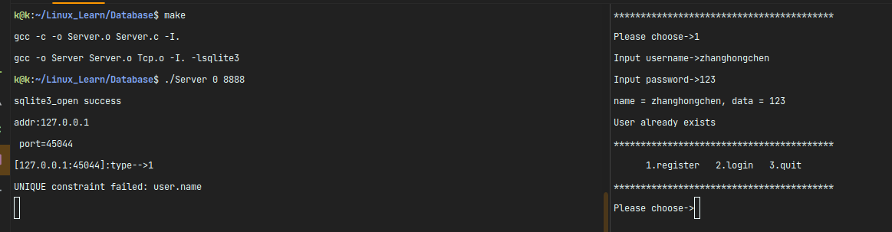
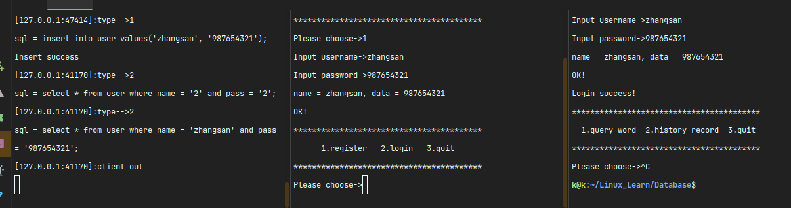

> - [2023-12-16][V1.0.00] client端框架搭建，网络编程函数封装至Tcp.c中方便client与server端调用
> - [2023-12-16][V1.0.01] client编译通过无错误
> - [2023-12-16][V1.1.00] server端框架搭建，实现多进程并发服务器，测试通过
> - [2023-12-16][V1.1.01] 编写makefile文件，实现一键编译，完成server端注册及登录模块功能
> - [2023-12-16][V1.1.02] 搭建数据库,注册功能测试通过
> - 
> - [2023-12-16][V1.1.03] 完成多用户登录功能，测试通过
> - 
> - [2023-12-17][V1.1.04] 完成历史记录功能，测试通过
> - [2023-12-17][V1.1.04] 完成root用户权限功能
